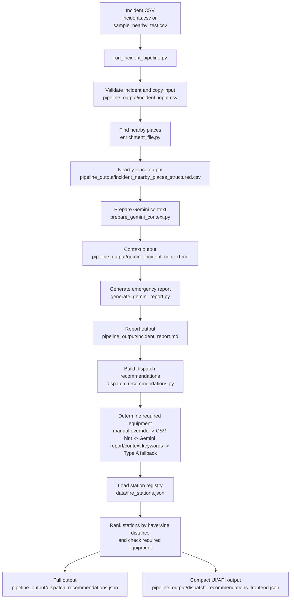

# Emergency Dispatch Recommendation Pipeline

This project is a command-line prototype for emergency incident analysis. It starts from an incident CSV, enriches the incident location with nearby OpenStreetMap and optional Google Places context, prepares a Gemini prompt context, optionally generates an emergency report, and writes deterministic dispatch recommendations for fire stations.

The project is focused on incidents in Lebanon. The fire-station equipment data is sample data for testing and should be verified before any operational use.

## What The Pipeline Produces

Running the pipeline creates files in `pipeline_output/`:

| Output | Description |
| --- | --- |
| `incident_input.csv` | Copy of the incident CSV used for the run. |
| `incident_nearby_places_structured.csv` | Nearby places found around the incident coordinates. |
| `gemini_incident_context.md` | Structured Markdown/JSON context prepared for Gemini. |
| `incident_report.md` | Gemini-generated emergency incident report. Created only when Gemini is enabled. |
| `dispatch_recommendations.json` | Full dispatch recommendation payload with ranked stations and equipment details. |
| `dispatch_recommendations_frontend.json` | Smaller dispatch recommendation payload for UI or API consumers. |

Generated outputs are not committed to Git because they can be recreated from the scripts and input data.

## Workflow Diagram



## Repository Files

| File | Description |
| --- | --- |
| `run_incident_pipeline.py` | Main entry point. Runs the full workflow from incident CSV to nearby-place context, Gemini report, and dispatch recommendation JSON. |
| `api_server.py` | Local HTTP bridge for n8n/WhatsApp JSON. Accepts `POST /process-incident`, runs the pipeline, and returns compact dispatch JSON. |
| `enrichment_file.py` | Finds nearby places around incident coordinates using OpenStreetMap Overpass and, optionally, Google Places. |
| `prepare_gemini_context.py` | Builds the Markdown context file that summarizes the incident and nearby places for Gemini. |
| `generate_gemini_report.py` | Sends the prepared context to Gemini and saves the emergency incident report as Markdown. |
| `dispatch_recommendations.py` | Ranks fire stations and determines which stations have the required fire equipment types. |
| `data/fire_stations.json` | Fire-station registry used by the dispatch recommendation logic. Includes coordinates, region, phone, and sample equipment coverage. |
| `incidents.csv` | Minimal sample incident input CSV. |
| `sample_nearby_test.csv` | Sample incident input CSV with an explicit `radius_m` value for nearby-place testing. |
| `requirements.txt` | Python dependencies for the pipeline. |
| `.env.example` | Template for required local environment variables. Copy it to `.env.local` before running API-backed steps. |
| `.gitignore` | Git ignore rules for secrets, generated outputs, caches, and local-only files. |

## Input CSV Format

The main pipeline expects a CSV with at least these columns:

```csv
incidentId,eventType,latitude,longitude,severity
INC201,FIRE,33.93528,35.58972,80
```

Supported coordinate column names include `latitude`/`longitude`, `lat`/`lon`, `lat`/`lng`, `report_latitude`/`report_longitude`, and `seed_lat`/`seed_lon`.

Optional useful columns:

| Column | Description |
| --- | --- |
| `radius_m` | Search radius in meters for nearby-place enrichment. |
| `requiredEquipment` | Manual equipment override, such as `Type A,Type C`. |
| `fire_class` or `true_class` | Fire class/equipment hint used by dispatch ranking. |

## Setup

Create and activate a virtual environment:

```bash
python3 -m venv .venv
source .venv/bin/activate
pip install -r requirements.txt
```

Create a local environment file:

```bash
cp .env.example .env.local
```

Fill in `.env.local`:

```bash
GOOGLE_MAPS_API_KEY=put_your_google_maps_api_key_here
GEMINI_API_KEY=put_your_gemini_api_key_here
```

`GOOGLE_MAPS_API_KEY` is needed only when using `--places-source google` or `--places-source both`. `GEMINI_API_KEY` is required for the full pipeline because Gemini generates the emergency incident report.

## Run The Pipeline

Run with OpenStreetMap, Google Places, and Gemini report generation:

```bash
python3 run_incident_pipeline.py --input sample_nearby_test.csv --places-source both
```

Run a specific incident from a multi-row CSV:

```bash
python3 run_incident_pipeline.py --input incidents.csv --incident-id INC201 --places-source both
```

Override required equipment manually:

```bash
python3 run_incident_pipeline.py --input sample_nearby_test.csv --places-source both --required-equipment "Type A,Type C"
```

## n8n / WhatsApp API Bridge

Start the local API server:

```bash
python3 api_server.py --host 127.0.0.1 --port 8000
```

If n8n runs in Docker, expose the API on all local interfaces instead:

```bash
python3 api_server.py --host 0.0.0.0 --port 8000
```

Health check:

```bash
curl http://127.0.0.1:8000/health
```

Add an n8n **HTTP Request** node after the node that fetches or normalizes the WhatsApp JSON:

| Setting | Value |
| --- | --- |
| Method | `POST` |
| URL | `http://127.0.0.1:8000/process-incident` |
| Send Body | On |
| Body Content Type | `JSON` |
| Body | `{{ $json }}` |

If n8n runs in Docker, use this URL instead:

```text
http://host.docker.internal:8000/process-incident
```

The API accepts either normalized incident JSON or raw WhatsApp Cloud API-style JSON. Normalized JSON should look like:

```json
{
  "incidentId": "WA_TEST_001",
  "eventType": "FIRE",
  "latitude": 33.8938,
  "longitude": 35.5018,
  "severity": 80,
  "radius_m": 100,
  "messageText": "Fire near the building",
  "placesSource": "osm",
  "skipLlm": true
}
```

The API writes each run under `pipeline_output/n8n_runs/`, runs `run_incident_pipeline.py`, and returns the compact dispatch payload that n8n can post to the already-developed webhook.

Useful request options:

| Field | Description |
| --- | --- |
| `placesSource` | `osm`, `google`, or `both`. Defaults to `osm`. |
| `skipLlm` | `true` skips Gemini for faster tests. Defaults to `false`. |
| `requiredEquipment` | Optional manual override such as `"Type A,Type C"`. |
| `pipelineTimeoutSeconds` | Optional timeout for the pipeline subprocess. Defaults to `420`. |

## Dispatch Equipment Types

The dispatch recommendation logic uses these equipment labels:

| Type | Meaning |
| --- | --- |
| `Type A` | Ordinary combustibles such as wood, paper, vegetation, textiles, and trash. |
| `Type B` | Flammable liquids and gases such as fuel, oil, gasoline, diesel, and solvents. |
| `Type C` | Energized electrical equipment, wiring, transformers, and charging infrastructure. |
| `Type D` | Combustible metals and specialist metal-fire response equipment. |
| `Type K` | Cooking oils, grease, and commercial kitchen fire response equipment. |

## Notes

- Station distances are straight-line haversine distances, not road travel distances.
- Google Places and Gemini calls require internet access and valid API keys.
- `.env.local` should stay local and should not be committed.
- The fire-station equipment assignments are sample data for prototype testing.
